# Práctica Maven

**Nombre:** Somil Vasandani Dhanwani  
**Curso:** 2º DAM  

# 03. Crear el primer proyecto Maven
## 1. Descripción

En esta práctica se ha trabajado con Maven.

El proyecto utilizado se denomina `gestor-tareas` y se ha trabajado principalmente con el archivo `pom.xml`, que contiene la configuración y la información necesaria para que Maven pueda gestionar el proyecto.

## 2. Configuración del proyecto

El proyecto tiene como nombre:

`gestor-tareas`

La información principal definida en el `pom.xml` es:

`<groupId>com.codelearn</groupId>`

`<artifactId>gestor-tareas</artifactId>`

`<version>1.0.0-SNAPSHOT</version>`

También se ha configurado el proyecto para utilizar Java 21 mediante:

`<maven.compiler.release>21</maven.compiler.release>`

El archivo `pom.xml` contiene además los plugins necesarios para la compilación, ejecución de pruebas y generación del archivo JAR.

## 3. Trabajo realizado

Durante la práctica solo modifiqué el elemento `artifactId` del archivo `pom.xml`.

Que inicialmente tenía el siguiente valor:

`<artifactId>gestor-tareas</artifactId>`

Cambié temporalmente el nombre del `artifactId` por `<artifactId>gestor-tareas-prueba</artifactId>` y ejecuté el siguiente comando:

`mvn validate`

Una vez realizada la validación, volví a cambiar el `artifactId` a su nombre original:

`<artifactId>gestor-tareas</artifactId>`

## 4. Validación del proyecto

Para comprobar que la configuración del proyecto era correcta utilicé:

`mvn validate`

La ejecución terminó correctamente mostrando:

`BUILD SUCCESS`

Esto indica que Maven pudo leer y validar correctamente la configuración del proyecto.

## 5. Dificultades encontradas

Durante la realización de la práctica apareció un problema relacionado con el archivo `pom.xml`.

Maven mostraba el siguiente error:

El error indicaba que Maven encontraba el archivo `pom.xml`, pero no podía leer su contenido. Al hacer `cat pom.xml` no aparecía nada.

Para solucionarlo, hice `nano pom.xml` y pegué el contenido proporcionado, y luego, verifiqué que la configuración del `pom.xml` estuviera correctamente escrita.

Después de solucionar el problema, volví a ejecutar:

`mvn validate`

La validación se realizó correctamente y Maven mostró:

# 04. Compilar y entender los archivos generados

## 1. Descripción

En esta práctica se ha trabajado con la compilación de un proyecto Maven y con los archivos que se generan durante este proceso.

El proyecto utilizado se denomina `gestor-tareas` y se ha utilizado Maven para compilar el código Java y generar los archivos `.class` necesarios para poder ejecutar la aplicación sin utilizar un IDE.

También se ha comprobado la ubicación de los archivos generados dentro de la carpeta `target/`.

## 2. Compilación del proyecto

Para compilar el proyecto se utilizó el siguiente comando:

`mvn compile`

Maven compiló el código fuente del proyecto y generó los archivos `.class` dentro de la carpeta:

`target/classes`

La compilación terminó correctamente mostrando:

`BUILD SUCCESS`

## 3. Ejecución de la aplicación

Después de compilar el proyecto, ejecuté la aplicación directamente desde la terminal, sin utilizar el IDE, mediante:

`java -cp target/classes com.codelearn.tareas.Main`

La aplicación mostró el siguiente mensaje:

`Gestor de tareas preparado`

## 4. Dificultades encontradas

Durante la práctica apareció un problema relacionado con la versión de Java utilizada por Maven.

Al ejecutar:

`mvn compile`

Maven mostró el siguiente error:

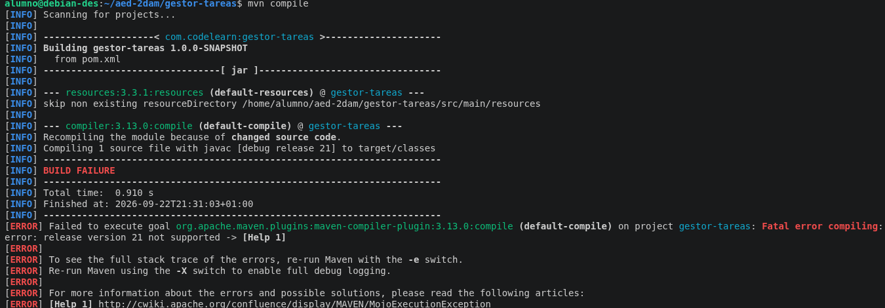

Para comprobar la versión de Java utilizada por Maven ejecuté:

`mvn -version`

Comprobé que Maven utilizaba Java 21, pero el sistema no tenía disponible el compilador `javac`.

Al comprobarlo mediante:

`which javac`

no obtuve ninguna ruta.

Para solucionarlo instalé el JDK de Java 21 mediante:

`sudo apt install openjdk-21-jdk`

Después de instalarlo, comprobé que `javac` estaba disponible y se volvió a ejecutar la compilación.

Finalmente, `mvn compile` terminó correctamente:

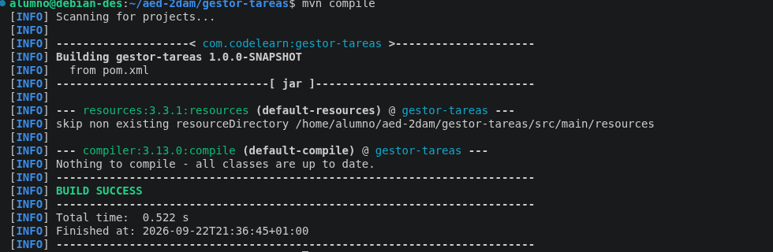

# 05. Ciclos de vida, fases y goals de Maven

## Descripción

En esta práctica se ha trabajado con los ciclos de vida, fases y goals de Maven. También se ha configurado el entorno para trabajar con dos versiones diferentes de Java y se ha comprobado cómo afecta la versión de Java utilizada a la compilación del proyecto.

### Comprobación del entorno

Se han comprobado los siguientes datos del entorno:

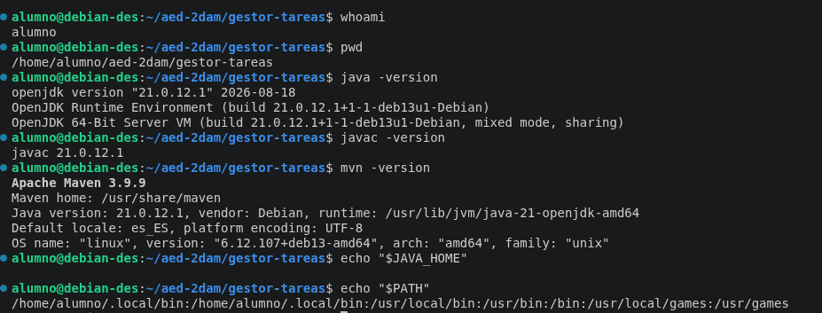

Las comprobaciones se encuentran en las capturas adjuntas.

### Instalación de Java 17

Se intentó instalar Java 17 mediante el paquete indicado en la práctica:

    sudo apt install openjdk-17-jdk

Sin embargo, Debian 13 Trixie no encontraba dicho paquete en los repositorios disponibles.

Por este motivo, se utilizó SDKMAN para instalar Java 17:

    sdk install java 17.0.20-tem

Java 21 no se eliminó y se mantuvieron las dos versiones instaladas.

### Comprobación de Java 17

Con Java 17 seleccionado, Maven utilizó Java 17 correctamente.

La versión instalada mediante SDKMAN fue:

    Java 17.0.20
    Temurin-17.0.20+8

### Prueba con Java 17

Con Java 17 se ejecutó:

    mvn clean verify

La compilación falló porque el proyecto está configurado para utilizar Java 21.

El error obtenido fue:

    error: release version 21 not supported

El resultado final fue:

    BUILD FAILURE

Esto ocurre porque Java 17 no puede compilar un proyecto configurado para utilizar `release 21`.

### Prueba con Java 21

Después se volvió a utilizar Java 21 y se ejecutó:

    mvn clean verify

La compilación terminó correctamente:

    BUILD SUCCESS

Maven compiló el proyecto utilizando Java 21.

### Archivos generados

Se comprobaron los archivos generados dentro de `target` mediante:

    find target -maxdepth 2 -type f | sort

El resultado fue:

    target/gestor-tareas-1.0.0-SNAPSHOT.jar
    target/maven-archiver/pom.properties

El archivo JAR generado es:

    target/gestor-tareas-1.0.0-SNAPSHOT.jar

## Dificultades encontradas

Durante la instalación de Java 17 mediante SDKMAN apareció un problema de espacio en disco:

    No space left on device

Se liberó espacio eliminando archivos de instalación que ya no eran necesarios y limpiando la caché. Después de liberar espacio se pudo instalar Java 17 correctamente.

También se comprobó que Debian 13 no encontraba el paquete `openjdk-17-jdk`, por lo que se utilizó SDKMAN como alternativa para disponer de una segunda versión de Java 17.

## Conclusión

En esta práctica he aprendido a trabajar con los ciclos de vida, fases y goals de Maven.

También he aprendido a trabajar con diferentes versiones del JDK y a comprobar cómo la versión de Java afecta a la compilación de un proyecto Maven.

Al utilizar Java 17, el proyecto no pudo compilar porque está configurado para utilizar Java 21. Al volver a Java 21, `mvn clean verify` terminó correctamente con `BUILD SUCCESS` y se generó el archivo JAR del proyecto.

# 06. Añadir y utilizar una dependencia

## Descripción

En esta práctica se ha añadido una dependencia externa al proyecto Maven y se ha utilizado la biblioteca Gson para trabajar con datos en formato JSON.

## Objetivo

El objetivo de la práctica es aprender a añadir una dependencia al `pom.xml` y utilizarla desde el código Java.

Una dependencia es una biblioteca que utiliza el código de la aplicación, mientras que un plugin ejecuta tareas relacionadas con la construcción del proyecto.

## Añadir la dependencia Gson

Se ha añadido la dependencia de Gson dentro de `<dependencies>` del archivo `pom.xml`:

    <dependencies>
        <dependency>
            <groupId>com.google.code.gson</groupId>
            <artifactId>gson</artifactId>
            <version>2.11.0</version>
        </dependency>
    </dependencies>

## Utilización de Gson

Se ha modificado `Main.java` para importar y utilizar la clase `Gson`.

El programa crea un `Map` con un título y un estado de completado y posteriormente convierte esos datos a formato JSON.

El resultado inicial obtenido fue:

    {"titulo":"Aprender Maven","completada":false}

## Compilación

Se ha utilizado el siguiente comando para compilar el proyecto:

    mvn compile

La compilación se realizó correctamente cuando se utilizó Java 21, demostrando que el import de Gson se resuelve correctamente.

## Árbol de dependencias

Se ha utilizado:

    mvn dependency:tree

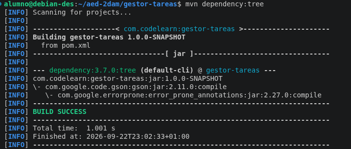

En el árbol de dependencias aparece Gson:

    com.google.code.gson:gson:jar:2.11.0:compile

Esto demuestra que Maven ha añadido correctamente la biblioteca al proyecto.

## Ejercicio

Cambié el título de la tarea en `Main.java` y he vuelto a compilar el proyecto para comprobar que el cambio funciona correctamente.

También se he retirado temporalmente la dependencia de Gson y se he ejecutado:

    mvn compile

La compilación produjo un error porque el código utiliza la clase `Gson` pero la dependencia ya no estaba disponible.

Después se restauró la dependencia de Gson y se volvió a compilar el proyecto.

## Problema encontrado

Al realizar la última compilación apareció el siguiente error:

    error: release version 21 not supported

El problema se produjo porque Java 17 estaba seleccionado en ese momento, mientras que el proyecto está configurado para utilizar Java 21.

Se volvió a seleccionar Java 21 y se ejecutó de nuevo:

    mvn compile

La compilación terminó correctamente con:

    BUILD SUCCESS

## Comprobación de la ejecución

También se comprobó que ejecutar directamente la aplicación utilizando únicamente el classpath de `target/classes` no incluye automáticamente las dependencias externas.

Por este motivo, al utilizar una dependencia como Gson puede aparecer un error `NoClassDefFoundError` si la biblioteca no se incluye en el classpath.

## Conclusión

En esta práctica he aprendido a añadir y utilizar una dependencia externa en un proyecto Maven.

He utilizado Gson para convertir datos de Java a formato JSON y he comprobado cómo Maven descarga y añade la biblioteca al proyecto mediante el árbol de dependencias.

También he comprobado que las dependencias son necesarias tanto para compilar como para ejecutar correctamente una aplicación que las utiliza.

Por último, he comprobado la importancia de utilizar la versión de Java compatible con la configuración del proyecto, ya que Java 17 produjo un error al intentar compilar un proyecto configurado para Java 21.

# 07. Maven Central y el repositorio local

## Objetivo

En esta práctica he aprendido cómo Maven utiliza Maven Central y el repositorio local para descargar, almacenar e instalar dependencias y artefactos.

También he comprobado cómo instalar mi propio proyecto en el repositorio local y cómo utilizar Maven en modo offline.

## 1. Localización de Gson

Primero comprobé que Gson 2.11.0 se encontraba en el repositorio local de Maven.

Para ello utilicé:

    ls ~/.m2/repository/com/google/code/gson/gson/2.11.0/

En esta carpeta se encuentran el archivo `.jar` y el archivo `.pom` de Gson.

## 2. Instalar el proyecto

Después ejecuté:

    mvn install

El comando terminó correctamente con `BUILD SUCCESS`.

Con `mvn install`, Maven instala el proyecto en el repositorio local.

### Captura

Aquí captura del `mvn install` con `BUILD SUCCESS`.

## 3. Proyecto en el repositorio local

Después de instalar el proyecto, comprobé que `gestor-tareas` se encontraba en el repositorio local.

La ruta es:

    ~/.m2/repository/com/codelearn/gestor-tareas/1.0.0-SNAPSHOT/

Dentro de esta carpeta aparecen el `.jar`, el `.pom` y `maven-metadata-local.xml`.

## 4. Ejecutar Maven en modo offline

Después comprobé que el proyecto podía construirse sin conexión a Internet mediante:

    mvn -o package

El comando terminó correctamente con `BUILD SUCCESS`:

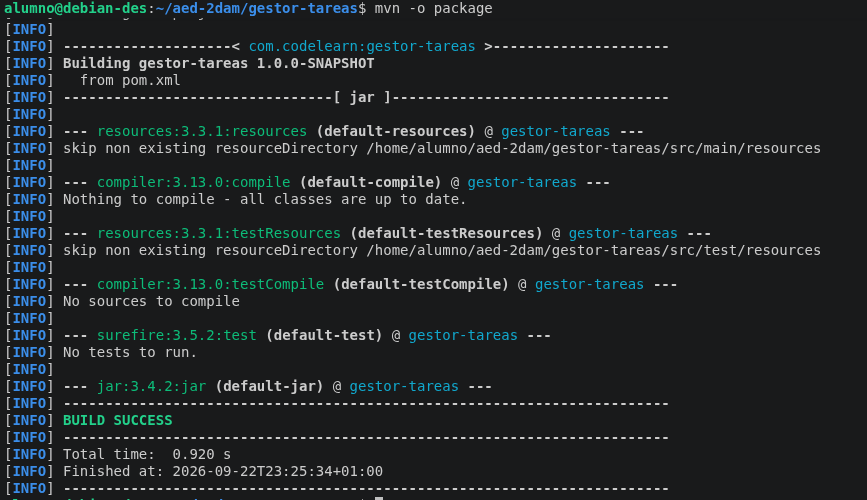

## 5. Localizar el POM de Gson

Localicé el POM de Gson mediante:

    ls ~/.m2/repository/com/google/code/gson/gson/2.11.0/gson-2.11.0.pom

La ruta obtenida fue:

    /home/alumno/.m2/repository/com/google/code/gson/gson/2.11.0/gson-2.11.0.pom

## 6. Localizar el POM de la aplicación

También localicé el POM de mi aplicación mediante:

    ls ~/.m2/repository/com/codelearn/gestor-tareas/1.0.0-SNAPSHOT/gestor-tareas-1.0.0-SNAPSHOT.pom

La ruta obtenida fue:

    /home/alumno/.m2/repository/com/codelearn/gestor-tareas/1.0.0-SNAPSHOT/gestor-tareas-1.0.0-SNAPSHOT.pom

## Conclusión

En esta práctica he aprendido cómo Maven almacena las dependencias en el repositorio local y cómo se pueden instalar nuestros propios proyectos en él.

También he comprobado que el proyecto puede construirse en modo offline cuando las dependencias y plugins necesarios ya están disponibles localmente.

Por último, he aprendido que `mvn install` no publica el proyecto para otras personas, ya que solamente lo instala en el repositorio local. Para publicarlo en un repositorio remoto se utiliza `mvn deploy`.

# 08. Repositorios externos y settings.xml

## Objetivo

En esta práctica he aprendido a separar la configuración del proyecto de la configuración del equipo mediante el uso de `settings.xml`.

El `pom.xml` contiene las necesidades y configuración del proyecto, mientras que `settings.xml` permite configurar aspectos propios del entorno, como repositorios, servidores, mirrors, proxies o perfiles.

## 1. Crear la carpeta config

Primero creé una carpeta llamada `config` dentro del proyecto `gestor-tareas`.

La estructura quedó de la siguiente forma:

    gestor-tareas/
    ├── config/
    ├── src/
    ├── pom.xml
    └── ...

## 2. Crear settings-publico.xml

Dentro de la carpeta `config` creé el archivo `settings-publico.xml`.

En este archivo añadí un perfil llamado `repositorio-publico`, que utiliza Maven Central mediante la URL:

    https://repo.maven.apache.org/maven2

El archivo no contiene credenciales ni información privada.

## 3. Activar el perfil repositorio-publico

Para comprobar que Maven podía utilizar el perfil creado, ejecuté:

    mvn -s config/settings-publico.xml -Prepositorio-publico help:active-profiles

El resultado mostró que el perfil `repositorio-publico` estaba activo y la ejecución terminó correctamente con `BUILD SUCCESS`.

## 4. Compilar utilizando el settings.xml

Después comprobé que el proyecto podía compilar utilizando el archivo de configuración creado y activando el perfil.

Ejecuté:

    mvn -s config/settings-publico.xml -Prepositorio-publico compile

La compilación terminó correctamente con `BUILD SUCCESS`.

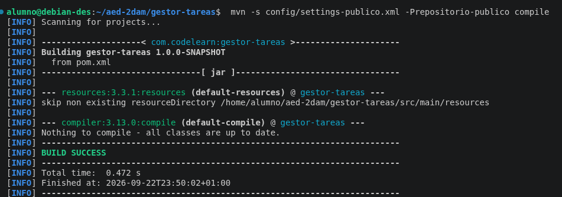

## 5. Comprobar la ejecución sin activar el perfil

Para comprobar la diferencia, ejecuté el mismo comando de comprobación pero sin utilizar `-Prepositorio-publico`:

    mvn -s config/settings-publico.xml help:active-profiles

En este caso no apareció ningún perfil activo.

Esto demuestra que el perfil `repositorio-publico` solamente se activa cuando se indica expresamente mediante `-Prepositorio-publico`.

El proyecto puede seguir utilizando Maven Central por defecto porque Maven Central está configurado como repositorio por defecto de Maven. Por tanto, no es necesario activar este perfil para poder utilizar Central en una configuración normal.

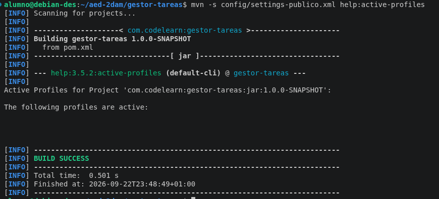

## 6. Comprobar la configuración efectiva

Finalmente utilicé el comando:

    mvn -s config/settings-publico.xml help:effective-settings

Este comando muestra la configuración efectiva que Maven está utilizando.

En el resultado se puede comprobar el repositorio local:

    /home/alumno/.m2/repository

También aparece el perfil `repositorio-publico` y el repositorio `central-explicito` con la URL de Maven Central.

El comando terminó correctamente con `BUILD SUCCESS`.

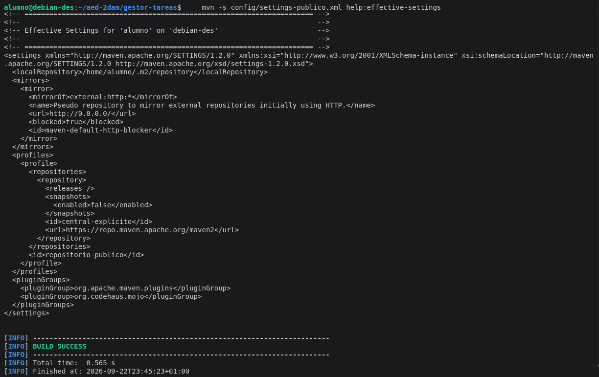

## 7. ¿Qué cambia al utilizar -Prepositorio-publico?

Al utilizar `-Prepositorio-publico`, Maven activa el perfil que hemos definido en `settings-publico.xml`.

Con:

    mvn -s config/settings-publico.xml -Prepositorio-publico help:active-profiles

aparece `repositorio-publico` entre los perfiles activos.

Sin utilizar `-Prepositorio-publico`:

    mvn -s config/settings-publico.xml help:active-profiles

el perfil no aparece como activo.

El proyecto puede seguir descargando dependencias desde Maven Central por defecto porque Central ya forma parte de la configuración predeterminada de Maven. El perfil creado sirve para practicar cómo añadir una configuración de repositorio mediante `settings.xml`, pero no es necesario para utilizar Central normalmente.

## 8. Diferencia entre POM y settings.xml

El `pom.xml` contiene la configuración y las necesidades del proyecto, por lo que forma parte del propio proyecto.

En cambio, `settings.xml` contiene configuración relacionada con el entorno donde se ejecuta Maven. Por ejemplo, puede contener repositorios, servidores, mirrors, proxies o perfiles.

Por este motivo, la configuración que es propia del proyecto puede estar en el `pom.xml`, mientras que la configuración específica de un equipo o usuario puede mantenerse en `settings.xml`.

## Conclusión

En esta práctica he aprendido a utilizar un archivo `settings.xml` separado del `pom.xml` para configurar el entorno de Maven.

He creado un perfil llamado `repositorio-publico` que utiliza Maven Central y he comprobado que se puede activar mediante `-Prepositorio-publico`.

También he comprobado que, sin activar el perfil, Maven sigue pudiendo utilizar Maven Central por defecto.

Finalmente, he utilizado `help:effective-settings` para comprobar la configuración efectiva de Maven y entender mejor cómo se combinan las diferentes configuraciones.

# 09. Repositorios privados, mirrors y proxy

## Objetivo

El objetivo de esta práctica es aprender a configurar Maven para trabajar con un repositorio privado, como Nexus o Artifactory, utilizando un mirror y credenciales mediante variables de entorno.

También se comprueba cómo Maven intenta acceder al repositorio configurado y cómo se puede diagnosticar un problema de conexión.

## 1. Configuración del repositorio privado

Se ha creado el archivo `config/settings-empresa.xml` para configurar el repositorio privado.

En este archivo se ha definido:

- Un servidor con el identificador `empresa`.
- El usuario mediante la variable de entorno `MAVEN_REPO_USER`.
- El token mediante la variable de entorno `MAVEN_REPO_TOKEN`.
- Un mirror con el identificador `empresa`.
- `mirrorOf` con el valor `*`, para indicar que todas las peticiones de repositorios deben pasar por este mirror.

La URL utilizada es una URL de ejemplo de Nexus:

    https://repo.empresa.example/repository/maven-public/

## 2. Protección del archivo de configuración

Como `settings-empresa.xml` contiene información relacionada con la configuración de acceso al repositorio privado, se ha añadido al archivo `.gitignore`.

El `.gitignore` contiene:

    config/settings-empresa.xml
    target/

De esta forma, `settings-empresa.xml` no se subirá al repositorio de GitHub.

## 3. Comprobación de Git

Se ha utilizado el siguiente comando:

    git status --short --ignored

El resultado muestra que `config/settings-empresa.xml` aparece como archivo ignorado:

    !! config/settings-empresa.xml

Esto confirma que Git está ignorando correctamente el archivo.

## 4. Prueba de Maven

Para comprobar la configuración se ha ejecutado:

    mvn -s config/settings-empresa.xml help:effective-settings

Maven ha intentado utilizar el mirror configurado con el identificador `empresa`.

En la salida se puede observar que Maven intenta descargar los plugins desde:

    https://repo.empresa.example/repository/maven-public/

Aquí captura.

## 5. Resultado de la prueba

La ejecución termina con `BUILD FAILURE` porque la dirección `repo.empresa.example` utilizada en la práctica es una dirección de ejemplo y no corresponde a un repositorio Nexus real disponible.

Por este motivo, Maven no puede descargar los plugins necesarios desde el mirror.

Esto permite comprobar que la configuración del mirror está siendo utilizada correctamente, aunque la conexión con un repositorio privado real queda pendiente.

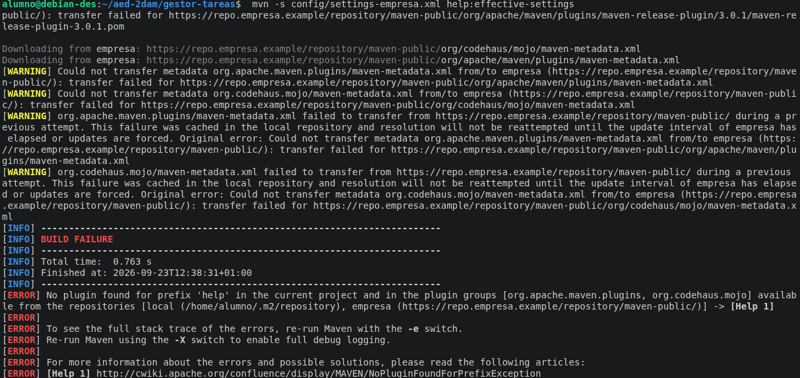

## 6. Conclusión

En esta práctica he aprendido a configurar Maven para utilizar un repositorio privado mediante un mirror.

También he aprendido a utilizar variables de entorno para no guardar directamente las credenciales en los archivos del proyecto y a utilizar `.gitignore` para evitar subir la configuración privada a GitHub.

Además, he comprobado cómo Maven intenta acceder al mirror configurado y cómo identificar un problema de conexión con el repositorio.

# 10. Profiles: activar configuraciones de Maven

## Objetivo

El objetivo de esta práctica es aprender a utilizar los perfiles de Maven para activar diferentes configuraciones del proyecto sin tener que duplicarlo.

Se han creado dos perfiles:

- `distribucion`, para generar un JAR con las dependencias incluidas.
- `informe`, para activar los avisos del compilador.

## 1. Perfil `distribucion`

Se ha creado el perfil `distribucion` dentro del archivo `pom.xml`.

Este perfil utiliza el plugin `maven-shade-plugin` para generar un JAR que incluye las dependencias necesarias para ejecutar la aplicación.

La clase principal utilizada es:

    com.codelearn.tareas.Main

Para activar el perfil se utiliza:

    mvn -Pdistribucion clean package

El proceso termina correctamente con `BUILD SUCCESS` y genera el archivo:

    target/gestor-tareas-1.0.0-SNAPSHOT-all.jar

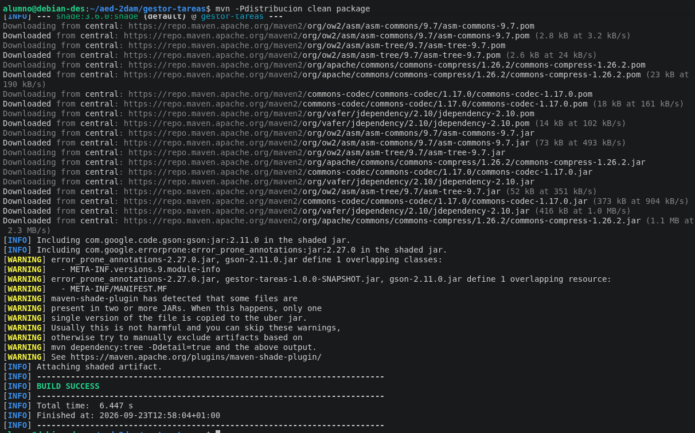

## 2. Ejecución del JAR

Una vez generado el JAR de distribución, se puede ejecutar directamente con:

    java -jar target/gestor-tareas-1.0.0-SNAPSHOT-all.jar

La aplicación se ejecuta correctamente y muestra un resultado en formato JSON:

    {"completada":false,"titulo":"Aprender JAVA"}

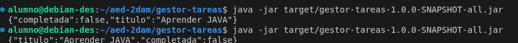

## 3. Perfil `informe`

Se ha creado el perfil `informe` para activar los avisos del compilador.

La propiedad utilizada es:

    maven.compiler.showWarnings=true

Además, se ha configurado una activación automática mediante una propiedad:

    <activation>
        <property>
            <name>informe</name>
            <value>true</value>
        </property>
    </activation>

De esta forma, el perfil se puede activar mediante:

    mvn -Dinforme=true help:active-profiles

El resultado muestra que el perfil `informe` está activo.

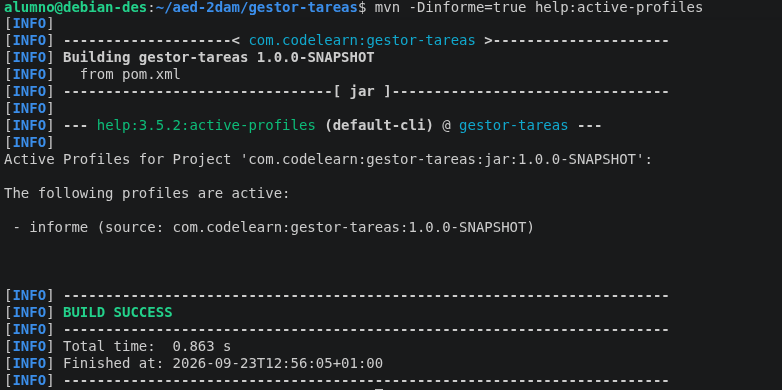

## 4. Activación de varios perfiles

Se ha comprobado que es posible activar los dos perfiles al mismo tiempo utilizando:

    mvn -Pdistribucion,informe clean verify

El proceso termina correctamente con `BUILD SUCCESS`.

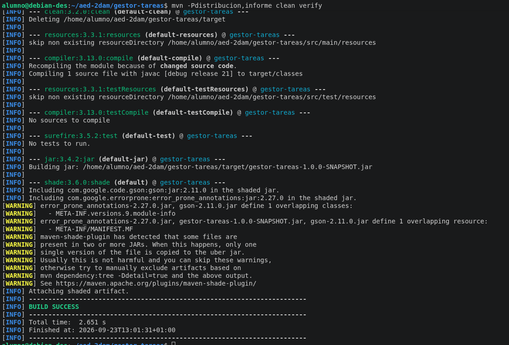

## 5. Comprobación del perfil `distribucion`

Para comprobar que el perfil `distribucion` está activo se ha utilizado:

    mvn -Pdistribucion help:active-profiles

El resultado muestra el perfil `distribucion` como perfil activo.

## 6. Comprobación del POM efectivo

También se ha utilizado el comando:

    mvn -Pdistribucion help:effective-pom

Este comando permite consultar el POM efectivo del proyecto.

En el resultado se puede comprobar que la configuración del perfil `distribucion`, incluyendo el plugin `maven-shade-plugin`, está aplicada.

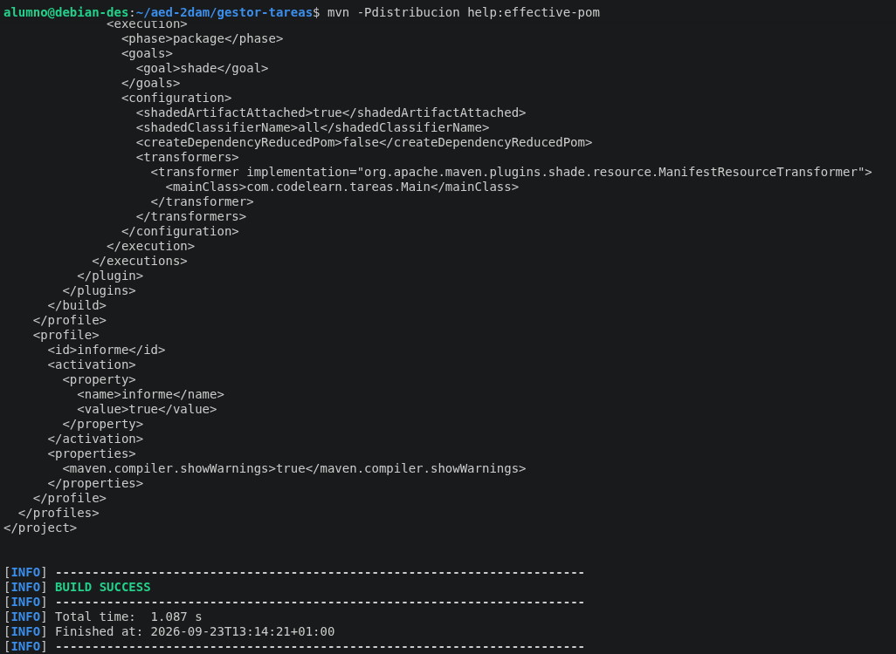

## Conclusión

En esta práctica he aprendido a crear y utilizar perfiles de Maven para aplicar diferentes configuraciones al proyecto.

También he aprendido a activar perfiles manualmente mediante `-P`, activarlos automáticamente mediante propiedades con `-D`, generar un JAR con sus dependencias y comprobar los perfiles activos mediante las herramientas de ayuda de Maven.