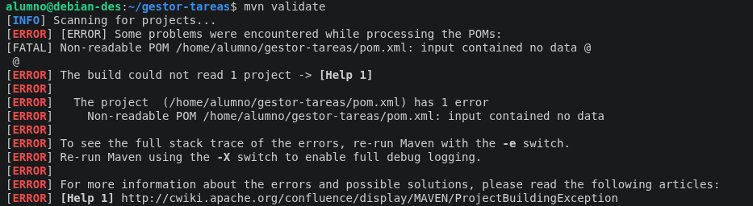
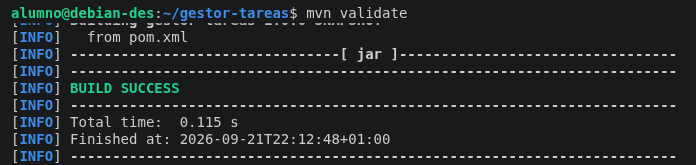

# Práctica Maven

**Nombre:** Somil Vasandani Dhanwani  
**Curso:** 2º DAM  

## 1. Descripción

En esta práctica se ha trabajado con Maven.

El proyecto utilizado se denomina `gestor-tareas` y se ha trabajado principalmente con el archivo `pom.xml`, que contiene la configuración y la información necesaria para que Maven pueda gestionar el proyecto.

## 2. Objetivos

Los principales objetivos de la práctica son:

- Entender cómo funciona Maven en un proyecto Java.
- Conocer la estructura básica de un proyecto Maven.
- Comprender la función del archivo `pom.xml`.
- Identificar los principales datos de configuración de un proyecto.
- Modificar el `artifactId` del proyecto.
- Utilizar el comando `mvn validate`.
- Comprobar que el proyecto está correctamente configurado.
- Restaurar la configuración original después de realizar la prueba.

## 3. Configuración del proyecto

El proyecto tiene como nombre:

`gestor-tareas`

La información principal definida en el `pom.xml` es:

`<groupId>com.codelearn</groupId>`

`<artifactId>gestor-tareas</artifactId>`

`<version>1.0.0-SNAPSHOT</version>`

También se ha configurado el proyecto para utilizar Java 21 mediante:

`<maven.compiler.release>21</maven.compiler.release>`

El archivo `pom.xml` contiene además los plugins necesarios para la compilación, ejecución de pruebas y generación del archivo JAR.

## 4. Trabajo realizado

Durante la práctica solo modifiqué el elemento `artifactId` del archivo `pom.xml`.

Que inicialmente tenía el siguiente valor:

`<artifactId>gestor-tareas</artifactId>`

Cambié temporalmente el nombre del `artifactId` por `<artifactId>gestor-tareas-prueba</artifactId>` y ejecuté el siguiente comando:

`mvn validate`

Una vez realizada la validación, volví a cambiar el `artifactId` a su nombre original:

`<artifactId>gestor-tareas</artifactId>`

## 5. Validación del proyecto

Para comprobar que la configuración del proyecto era correcta utilicé:

`mvn validate`

La ejecución terminó correctamente mostrando:

`BUILD SUCCESS`

Esto indica que Maven pudo leer y validar correctamente la configuración del proyecto.

## 6. Dificultades encontradas

Durante la realización de la práctica apareció un problema relacionado con el archivo `pom.xml`.

Maven mostraba el siguiente error:

El error indicaba que Maven encontraba el archivo `pom.xml`, pero no podía leer su contenido. Al hacer `cat pom.xml` no aparecía nada.

Para solucionarlo, hice `nano pom.xml` y pegué el contenido proporcionado, y luego, verifiqué que la configuración del `pom.xml` estuviera correctamente escrita.

Después de solucionar el problema, volví a ejecutar:

`mvn validate`

La validación se realizó correctamente y Maven mostró:

## 7. Resultado final

Al finalizar la práctica conseguí:

- Trabajar con un proyecto Maven.
- Comprender la función básica del archivo `pom.xml`.
- Modificar temporalmente el `artifactId`.
- Ejecutar correctamente `mvn validate`.
- Comprobar que Maven podía validar el proyecto.
- Restaurar el `artifactId` original.

La configuración final del proyecto mantiene:

`<groupId>com.codelearn</groupId>`

`<artifactId>gestor-tareas</artifactId>`

`<version>1.0.0-SNAPSHOT</version>`

## 8. Conclusión

Con esta práctica he aprendido a trabajar con la configuración básica de un proyecto Maven mediante el `pom.xml`.

También he aprendido a modificar el `artifactId` y a utilizar el comando `mvn validate` para comprobar que la configuración del proyecto está bien.

Además, al solucionar el problema relacionado con el archivo `pom.xml`, he aprendido a identificar y resolver un error básico.